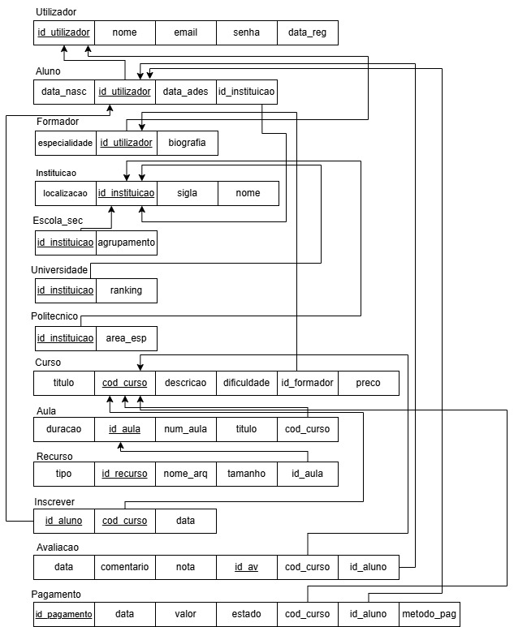

# BD: Trabalho Prático APFE

**Grupo**: P1G2
- Martim Gomes, MEC: 119488
- Fernando Ferreira, MEC: 119758

## Introdução / Introduction
 
O presente trabalho tem como objetivo a modelação e o desenvolvimento de uma base de dados relacional para uma plataforma de cursos online. O sistema foi desenhado para gerir de forma eficiente a interação entre dois perfis principais de utilizadores: os Formadores, responsáveis pela criação de cursos, aulas e os respetivos recursos didáticos; e os Alunos, que interagem com a plataforma através da inscrição em cursos, realização de pagamentos e submissão de avaliações ao curso. 

## ​Análise de Requisitos / Requirements

Requisitos funcionais:
- O sistema deve permitir o registo de utilizadores com nome, email, senha, data de registo e data utilizador.
- O sistema deve distinguir entre Alunos e Formadores, armazenando informações específicas para cada um deles (biografia e especialidade para formadores; idade e data - de nascimento para alunos).
- O sistema deve permitir o registo de instituições de ensino (Escolas Secundárias, Politécnicos e Universidades) às quais os alunos pertencem.
- Os formadores devem poder criar cursos definindo título, descrição, dificuldade e código do curso.
- Cada curso deve permitir a criação de múltiplas aulas organizadas por número, título, duração e id da aula.
- O sistema deve permitir associar recursos às aulas, registando o nome do arquivo, tipo, tamanho do ficheiro e o id do recurso.
- O sistema deve permitir que um aluno se inscreva em vários cursos.
- O sistema deve processar e registar os pagamentos das inscrições, incluindo o método,id do pagamento, valor, data e estado da transação em questão na altura(pendente/concluído).
- Os alunos podem submeter avaliações sobre os cursos que eles frequentam.
- O sistema deve registar e gerir o enquadramento académico do Aluno, associando esse mesmo aluno a uma Instituição de Ensino específica (Escola Secundária, Universidade ou Politécnico).

Requisitos não funcionais:
- As senhas de todos os utilizadores devem ser armazenadas na base de dados de forma encriptada.
- A base de dados deve garantir certas restrições de consistência, como por exemplo, assegurar que a nota de uma Avaliação seja obrigatoriamente um valor entre 1 e 5.
- A base de dados deve suportar o crescimento do número de alunos e o volume de recursos que estão anexados às aulas.
- Todos os pagamentos devem ser registados de forma a evitar perda de dados em caso de falha.
- O sistema de base de dados deve garantir alta disponibilidade, com backups regulares para evitar perda de informação também sobre inscrições.
- A base de dados deve conseguir suportar várias pesquisas ao mesmo tempo (ex: vários alunos a pesquisar cursos ao mesmo tempo) com tempos de resposta inferiores a x segundos, sendo x 2 ou 3 segundos.
- O sistema deve proteger os dados pessoais dos utilizadores de forma extremamente segura.

## DER

## ER

